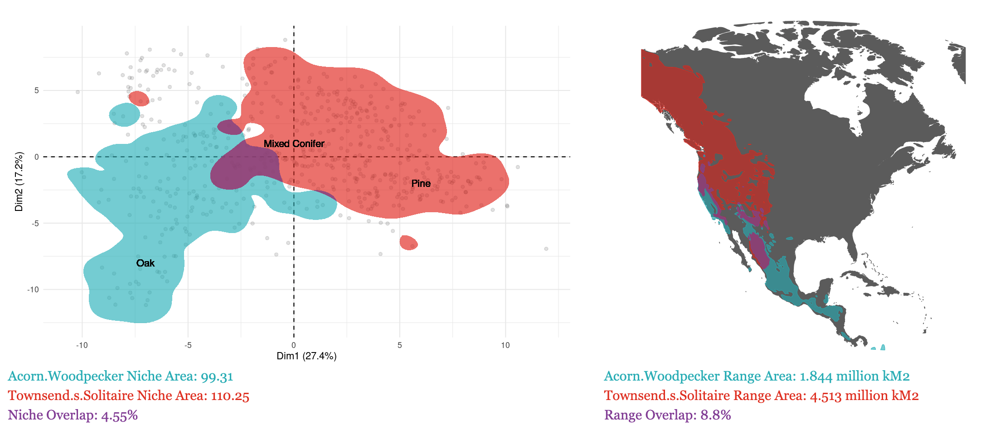

# AviSpace
Avian niche specificity and overlap in the Sierra Nevada

AviSpace is a Shiny application which uses principal components analysis and remotely sensed geospatial habitat variables in combination with passive acoustic monitoring and machine learning species classifiers to quantify the prefered habitat niche of 88 bird species in the Sierra Nevada, USA. 

# Functionalities

## AviSpace 4.0
1. View prefered habitat niche polygons and overlap of any two selected species
2. View range map and range overlap of any two selected species
3. View boxplots of any single habitat variable vs any number of species

# Accesibility

The AviSpace app can be accessed online at https://pe6zh8-laura-berman.shinyapps.io/Avispace4/ 

Alternatively, you can download the shiny app to run locally [View the Shiny app folder](AviSpace4.0/)

# Citation

If you use AviSpace in your published work, please cite the original manuscript:

Berman, LM; Schneider, FD; Pavlick, RP; Peery, MZ; Wood, CM; Zheng, T; Shafron, E; Ye, Z; Queally, N; Dean, M; Tagliabue, G; Winiarski, J; Kramer, A; Townsend, P. (in prep) Remote sensing and bioacoustics reveal avian niche partitioning and habitat filtering

