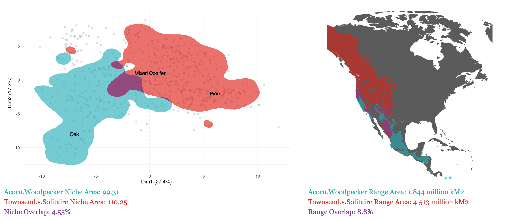

# AviSpace
Avian niche specificity and overlap in the Sierra Nevada

AviSpace is a Shiny application which uses principal components analysis and remotely sensed geospatial habitat variables in combination with passive acoustic monitoring and machine learning species classifiers to quantify the prefered habitat niche of 90 bird species in the Sierra Nevada, USA. 

# Functionalities

1. View prefered habitat niche polygons and overlap of any two selected species
2. View range map and range overlap of any two selected species
3. View boxplots of any single habitat variable vs any number of species

# Accessibility

The AviSpace app can be accessed online at (https://kalmialatifolia.shinyapps.io/Avispace4/)

Alternatively, you can download the shiny app to run locally: [View the Shiny app folder](AviSpace4.0/)

# File descriptions

**AviSpace4.0** - Self contained Shiny app for download

**speciesDetails.csv**  - CSV file containing total number of detections, total number of sites where the species was detected, and niche area for each of the 90 species.

**GeospatialMetadata.csv** - CSV file containing details on each of the geospatial variables used as eigenvectors in the PCA, including variable descriptions and links to the original publications and datasets.

**fullProtocol.R** - R script containing the complete data processing pipeline.

# Variable Definitions

**speciesDetails.csv**
| Variable | Description |
|----------|-------------|
| species | Species common name |
| nicheArea | Species habitat niche area in unitless PC space. Habitat specialists have smaller habitat niche areas, generalists have larger ones |
| totalDetections | The total number of times this species was detected with greater than 90% certainty across 577 monitoring sites for the duration of the study |
| totalSites | The total number of sites where this species was detected at least once with greater than 90% certainty across the duration of the study |

**GeospatialMetadata.csv**
| Variable | Description |
|----------|-------------|
| Variable Name | Shorthand variable name used in R scripts and column headers |
| Category | One of six possible BioCube categories: Climate, Disturbance, Function, Phenology, Physiology, Terrain |
| Description | Longhand variable definition |
| Source | Original academic article where this dataset was published, First author and publication year |
| DOI | DOI link to access the original publication |
| Dataset | Link to access the repository where the dataset is stored |
| Used in PCA | Was this variable used in the final principal component analysis? Yes or no |
| Notes | Notes. If this variable was not used in the final analysis, why? |

# Citation

If you use AviSpace in your published work, please cite the original manuscript:

Berman, LM; Schneider, FD; Pavlick, RP; Peery, MZ; Wood, CM; Zheng, T; Shafron, E; Ye, Z; Queally, N; Dean, M; Tagliabue, G; Winiarski, J; Kramer, A; Townsend, P. (in prep) Remote sensing and bioacoustics reveal avian niche partitioning and habitat filtering

